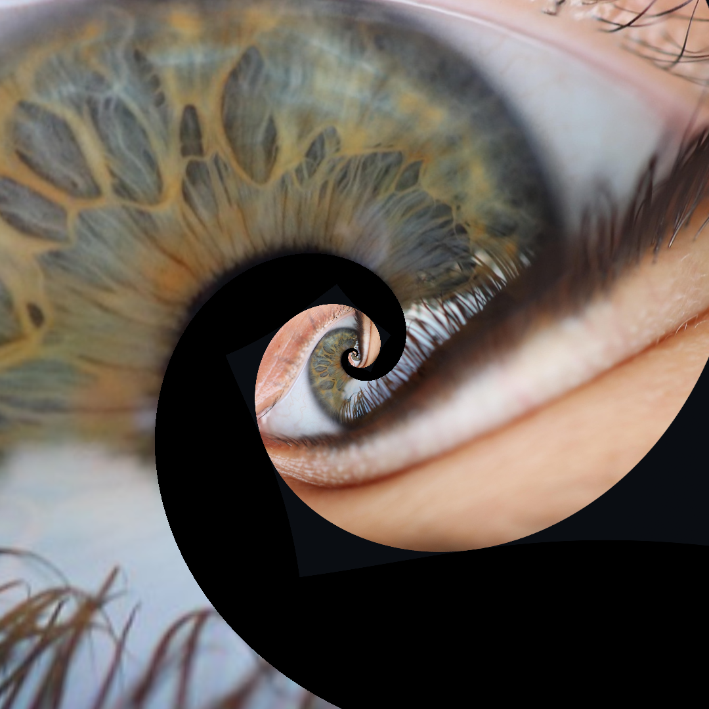

# Conformal Droste Animation Engine

A Python-based implementation of the Droste Effect (recursive image-in-image) using conformal mapping, optimized with Apple's **MLX** framework for GPU-accelerated real-time performance.

## Prerequisites: The Source Image

The Droste effect requires a specific type of source image where the image contains a smaller version of itself (or a "seed" area) to create the infinite recursion. To ensure the smoothest math and animation, follow these guidelines:

### 1. The "Perfect Square" Prep
For the most straightforward configuration, crop your source image into a **square** with your focal point (e.g., an eye, a window, or a frame) positioned exactly in the center.
* **Why?** This simplifies your variables: `FocX` and `FocY` will simply be half of the image's side length.
* **Calculating Ratio:** Your `Outer` value will be the length of the side of the larger square, and `Inner` will be the length of the side of the smaller embedded square.

### 2. Smoothing the Loop
To prevent harsh edges where the images tile, use a circular "mask" for the transition:
* Place the outer image inside of a **circle**.
* Ensure the background color of this circle matches the area that will surround it in the focal point. This creates a seamless "bleed" effect during the zoom.

### 3. Generating your Source Image in GIMP
1. Open your primary image in [GIMP](https://www.gimp.org/) (a free, open-source image editor).
2. Crop the image to a square and identify the centered "focal point."
3. Paste a scaled-down version of your image into that focal point.
4. Export the file as `input.png` and place it in the `/assets` directory.
5. **Example:** See `/assets/centered_eye.png` for a reference on how a centered, circular-masked source image should look.

## Project Structure
- `/assets`: Put your source `hifi.png` here (see `centered_eye.png`).
- `/scripts`: Contains the execution logic.
- `/out`: Where the generated GIFs/Images are saved.

## Usage

### 1. Live Projection (`main_projection.py`)
Used for real-time exploration or projecting onto a wall.
- **Controls:**
  - `F`: Toggle Fullscreen (Centers the animation with black letterboxing).
  - `Space`: Play/Pause.
  - `R`: Reset to default zoom/parameters.
  - `Q`: Quit.

### 2. Multi-Platform Exporter (`export_all.py`)
Automatically calculates the mathematical loop duration to generate a **perfect, seamless loop** for different platforms:
- **Reddit:** High-quality 800x800, 30fps.
- **Discord:** Optimized under 10MB (400x400, 15fps).
- **Slack:** Ultra-light under 2MB for autoplay (300x300, 10fps, 128 colors).

## Inspiration & Attribution
- **3Blue1Brown:** [How (and why) to take a logarithm of an image](https://www.youtube.com/watch?v=ldxFjLJ3rVY) — Excellent visual explanation of the complex analysis and conformal mapping used in this project.
- Source code available at: [https://github.com/aliotta/conformal](https://github.com/aliotta/conformal)

## License
This project is licensed under the MIT License - see the [LICENSE](LICENSE) file for details.